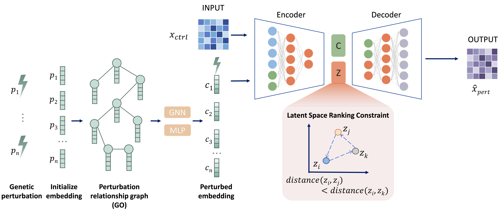

# GO-CVAE Build Status

* Gene Perturbation Prediction Algorithm Based on Functional Association Constraints



## Introduction

GO-CVAE (Gene Ontology-constrained Conditional Variational Autoencoder) is a generative model for predicting single-cell gene perturbation responses, incorporating Gene Ontology functional priors into both condition encoding and latent space optimization to enable generalization to unseen genetic perturbations. GO-CVAE is implemented using TensorFlow/Keras.

## Installation

Before installing GO-CVAE package, we suggest you to create a new Python 3.8 conda env with the following steps:

### 1. Installing virtualenv

```
conda create -n GOCVAE-env python==3.8
conda activate GOCVAE-env
```

### 2. GO-CVAE package installation

Configure the environment using the requirements.txt file.

```
pip install -r requirements.txt
```

## Examples

See the tutorial folder for example.